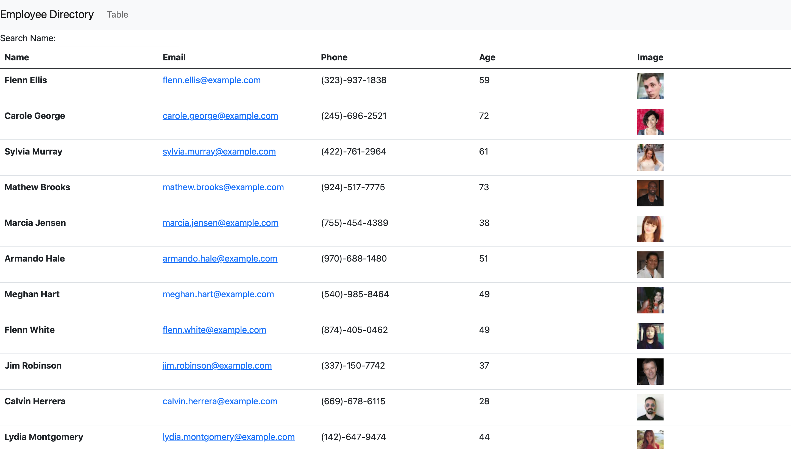

   

# 19. React Homework: Employee Directory

## Description
We had been learning how to use React to write jss to build our website. I learn how to use components and props to pass down the variable we want it to be use in another components. It was challenge to using this new kinds of  react thinking to work it logically. Overall I was able to get all the pieces together and render the page in the way was expected.
   

## Deployed Link:
[Employee Directory](https://anniechen9025.github.io/Employee-Directory/)

## Example:

## Built With:
- [HTML5](https://html.com/html5/)
- [CSS](https://www.w3.org/Style/CSS/)
- [Javascript](https://www.javascript.com/)
- [Node.js](https://nodejs.org/en/)
- [Express.js](https://expressjs.com/)
- [React](https://www.npmjs.com/package/react)
- [Bootstrap](https://www.npmjs.com/package/bootstrap)

## License
MIT 

## Badges

## Questions
        Please feel free to contact: 
        Github:https://github.com/anniechen9025/
        Email:anniechen9025@gmail.com
